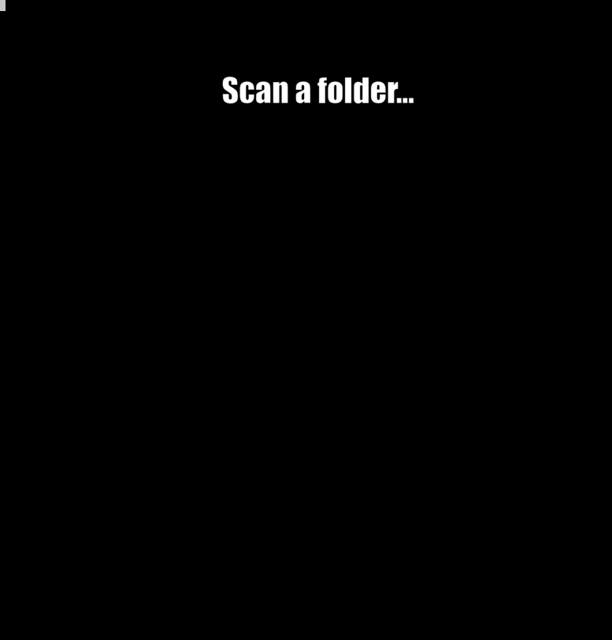

# diskonaut


## How does it work?

Given a path on your hard-drive (which could also be the root path, eg. "/"). `diskonaut` scans it and maps it to memory so that you could explore its contents (even while still scanning!).

Once completed, you can navigate through subfolders, getting a visual treemap representation of what's taking up your disk space. You can even delete files or folders and `diskonaut` will track how much space you've freed up in this session.

## Installation

### Download a prebuilt binary
If you're using linux, you can check out the "releases" of this repository to download the latest prebuilt binary.

### With cargo
`cargo install diskonaut`

## Supported platforms
Right now `diskonaut` supports linux and macos. If you're on a different operating system and would like to help port it, that would be amazing!

## Usage
Either start `diskonaut` in the folder you want to scan, or provide it with the folder you'd like to scan as an argument:
```
$ diskonaut /home/aram
```

## Contributing
Contributions of any kind are very much welcome. If you think `diskonaut` is cool and you'd like to hack at it, feel free to look through the issues. Take a look especially at ones marked "help wanted" or "good first issue".
Also, if you found a bug or have an idea for a new feature, please feel free to open an issue to discuss it.

If at any point you feel stuck, are unsure how to begin or what to work on, please do not hesitate to reach out to me personally: aram@poor.dev

## License
MIT
